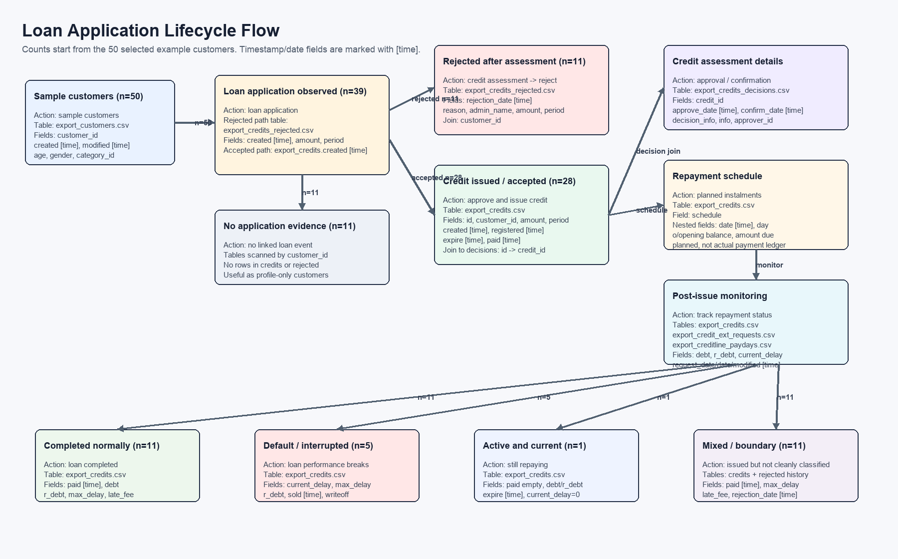

# Sampled Customer Lifecycle Examples

Sample method: `200` random customers from `export_customers.csv`, seed `20260608`.
Selected examples: `50` customers from that sample.

Large-file strategy: sample customer IDs first, then stream each CSV and keep only matching rows. `export_credits_decisions.csv` has no `customer_id`, so the script first collects `export_credits.id`, then joins `credits.id -> decisions.credit_id`.

## How to Join One Customer Across Tables

- Direct `customer_id` lookup: `export_customers.csv`, `export_credits.csv`, `export_credits_rejected.csv`, `export_credit_ext_requests.csv`, `export_creditline_paydays.csv`, and the combined export.
- Indirect lookup for decisions: `export_customers.customer_id -> export_credits.customer_id`, then `export_credits.id -> export_credits_decisions.credit_id`.
- The combined export is useful as a check, but the source tables are clearer for lifecycle logic.

## Lifecycle Flowchart

The flowchart branch counts start from the 50 selected example customers, while the next section reports counts for the full 200-customer random sample.

## Case Counts In The 200-Customer Sample

- `1_direct_rejected`: 107
- `2_issued_default_or_interrupted`: 5
- `3_issued_clean_completed`: 23
- `4_issued_active_current`: 1
- `5_issued_other_or_mixed`: 11
- `7_no_application_found`: 53

## Linked Rows Found For The 200 Customers

- `issued_credits`: 108
- `rejected_applications`: 320
- `extension_requests`: 32
- `payday_snapshots`: 0
- `decision_rows`: 64
- `combined_rows`: 227

## Interpretation Notes

- `1_direct_rejected`: rejected applications exist and no issued credit was found for this customer in the sample-linked scan.
- `2_issued_default_or_interrupted`: at least one issued credit is unpaid and has debt plus a strong default signal such as high delay, sale/writeoff, or overdue maturity.
- `3_issued_clean_completed`: at least one issued credit has `paid` set, zero debt, zero max delay, and zero late fee.
- `4_issued_active_current`: at least one issued credit is unpaid, has outstanding debt, has no current/max delay, and its due date is not before the analysis date.

## Selected Customer Examples

### Customer `45737` - `1_direct_rejected`

- Customer snapshot: age `61`, gender `m`, created `2020/1/3 14:24`, applications `0`, customer-table credits `0`, credits_paid `0`, delay_max `0`.
- Linked rows: issued credits `0`, rejected applications `2`, extension requests `0`, payday snapshots `0`, decision rows `0`, combined rows `2`.
- Rejected example: id=219808; created=2025/3/31 18:13; amount=1000; period=1500; rejection_date=2025/3/31 18:30; reason=[23]: Kita  (NEGAUTI ATLYGINIMAI UŽ VASARĮ IR SAUSĮ )
- Rejected example: id=235043; created=2025/6/6 12:35; amount=6000; period=1800; rejection_date=2025/6/6 12:40; reason=[41]: N_ra sutuoktinio sutikimo (Asmeninio kredito suteikti negalime, perteikti 

### Customer `50772` - `2_issued_default_or_interrupted`

- Customer snapshot: age `31`, gender `m`, created `2020/9/14 16:53`, applications `0`, customer-table credits `1`, credits_paid `0`, delay_max `293`.
- Linked rows: issued credits `9`, rejected applications `1`, extension requests `7`, payday snapshots `0`, decision rows `1`, combined rows `63`.
- Rejected example: id=126735; created=2020/9/14 16:58; amount=300; period=90; rejection_date=2020/9/14 19:21; reason=[20]: EUCB (įsp 0/pajamos 2700); [29]: GRT; [39]: PRDB; [8]: Skambutis (neteisin
- Representative credit: id `144879`, created `2021-08-04 10:45:00`, amount `1493.28`, period `210`, expire `2022-03-02`, paid `0000-00-00 00:00:00`, debt `0.00`, r_debt `2013.08`, current_delay `293`, max_delay `473`, late_fee `33.06`, sold `2022-12-20`.
- Extension example: credit_id=128650; request_date=2020/11/20 08:19; period=210; complete_date=2020/11/20 08:19; price=516.28
- Extension example: credit_id=130630; request_date=2020/12/30 17:50; period=210; complete_date=2020/12/30 17:50; price=516.28

### Customer `46000` - `3_issued_clean_completed`

- Customer snapshot: age `42`, gender `f`, created `2020/1/14 16:01`, applications `0`, customer-table credits `2`, credits_paid `2`, delay_max `0`.
- Linked rows: issued credits `2`, rejected applications `3`, extension requests `0`, payday snapshots `0`, decision rows `2`, combined rows `6`.
- Rejected example: id=152575; created=2021/12/7 14:18; amount=500; period=720; rejection_date=2021/12/7 14:40; reason=[20]: EUCB (isip 0 paj 614); [29]: GRT; [39]: PRDB; [8]: Skambutis; [4]: Sodra; 
- Rejected example: id=136751; created=2021/3/8 15:58; amount=1100; period=540; rejection_date=2021/3/8 16:06; reason=[19]: Dar negr_žintas kreditas KC; [20]: EUCB (įsip0/pj700); [8]: Skambutis (POK
- Representative credit: id `110957`, created `2020-01-14 18:23:49`, amount `400.00`, period `1080`, expire `2022-12-29`, paid `2020-05-04 18:11:00`, debt `0.00`, r_debt `0.00`, current_delay `0`, max_delay `0`, late_fee `0.00`, sold `0000-00-00`.
- Schedule preview: 2020-02-13: opening_balance=400.00, due=22.20 | 2020-03-14: opening_balance=393.24, due=22.20 | 2020-04-13: opening_balance=386.30, due=22.20

### Customer `75700` - `4_issued_active_current`

- Customer snapshot: age `31`, gender `m`, created `2024/6/17 10:13`, applications `0`, customer-table credits `1`, credits_paid `0`, delay_max `0`.
- Linked rows: issued credits `1`, rejected applications `0`, extension requests `0`, payday snapshots `0`, decision rows `1`, combined rows `0`.
- Representative credit: id `201625`, created `2024-06-17 15:04:49`, amount `900.00`, period `1080`, expire `2027-06-17`, paid `0000-00-00 00:00:00`, debt `649.74`, r_debt `649.74`, current_delay `0`, max_delay `0`, late_fee `0.00`, sold `0000-00-00`.
- Schedule preview: 2024-07-17: opening_balance=900.00, due=49.98 | 2024-08-17: opening_balance=884.80, due=49.98 | 2024-09-17: opening_balance=869.19, due=49.98
- Decision example for credit `201625`: confirmer_id=66

### Customer `52972` - `5_issued_other_or_mixed`

- Customer snapshot: age `39`, gender `f`, created `2021/1/22 09:02`, applications `0`, customer-table credits `1`, credits_paid `1`, delay_max `20`.
- Linked rows: issued credits `1`, rejected applications `6`, extension requests `0`, payday snapshots `0`, decision rows `1`, combined rows `6`.
- Rejected example: id=145508; created=2021/8/15 16:34; amount=3000; period=1080; rejection_date=2021/8/16 10:18; reason=[19]: Dar negr_žintas kreditas KC; [20]: EUCB (įsip100/pj900); [29]: GRT; [6]: P
- Rejected example: id=156151; created=2022/2/4 10:34; amount=2950; period=1020; rejection_date=2022/2/4 11:40; reason=[20]: EUCB (isip 150 paj 1050); [29]: GRT; [23]: Kita  (Neatsinaujinusi PRDB, si
- Representative credit: id `134115`, created `2021-01-22 17:22:57`, amount `400.00`, period `660`, expire `2022-11-13`, paid `2022-02-04 09:42:00`, debt `0.00`, r_debt `0.00`, current_delay `20`, max_delay `20`, late_fee `2.74`, sold `0000-00-00`.
- Schedule preview: 2021-02-21: opening_balance=400.00, due=36.36 | 2021-03-23: opening_balance=390.12, due=36.36 | 2021-04-22: opening_balance=379.70, due=36.36

### Customer `45986` - `7_no_application_found`

- Customer snapshot: age `25`, gender `m`, created `2020/1/14 09:05`, applications `0`, customer-table credits `0`, credits_paid `0`, delay_max `0`.
- Linked rows: issued credits `0`, rejected applications `0`, extension requests `0`, payday snapshots `0`, decision rows `0`, combined rows `0`.

### Customer `45943` - `1_direct_rejected`

- Customer snapshot: age `44`, gender `m`, created `2020/1/13 10:32`, applications `0`, customer-table credits `0`, credits_paid `0`, delay_max `0`.
- Linked rows: issued credits `0`, rejected applications `1`, extension requests `0`, payday snapshots `0`, decision rows `0`, combined rows `1`.
- Rejected example: id=198922; created=2024/4/30 15:11; amount=300; period=90; rejection_date=2024/5/2 11:00; reason=[41]: N_ra sutuoktinio sutikimo

### Customer `54405` - `2_issued_default_or_interrupted`

- Customer snapshot: age `32`, gender `m`, created `2021/4/27 11:47`, applications `0`, customer-table credits `1`, credits_paid `0`, delay_max `423`.
- Linked rows: issued credits `1`, rejected applications `1`, extension requests `0`, payday snapshots `0`, decision rows `1`, combined rows `0`.
- Rejected example: id=145915; created=2021/8/21 11:21; amount=100; period=90; rejection_date=2021/8/23 09:31; reason=[19]: Dar negr_žintas kreditas KC (turi max, limitas 400); [20]: EUCB (įsip0/pj1
- Representative credit: id `139228`, created `2021-04-27 18:49:13`, amount `500.00`, period `360`, expire `2022-04-22`, paid `0000-00-00 00:00:00`, debt `0.00`, r_debt `256.80`, current_delay `423`, max_delay `543`, late_fee `6.39`, sold `2023-06-19`.
- Schedule preview: 2021-05-27: opening_balance=500.00, due=66.04 | 2021-06-26: opening_balance=470.58, due=66.04 | 2021-07-26: opening_balance=439.36, due=66.04

### Customer `47035` - `3_issued_clean_completed`

- Customer snapshot: age `29`, gender `m`, created `2020/2/24 18:03`, applications `0`, customer-table credits `5`, credits_paid `5`, delay_max `17`.
- Linked rows: issued credits `7`, rejected applications `3`, extension requests `2`, payday snapshots `0`, decision rows `5`, combined rows `42`.
- Rejected example: id=113826; created=2020/2/24 18:03; amount=100; period=120; rejection_date=2020/2/25 17:31; reason=api
- Rejected example: id=113903; created=2020/2/25 17:31; amount=100; period=120; rejection_date=2020/2/25 17:37; reason=[20]: EUCB (pajamos 800/ įsip. 0); [29]: GRT; [33]: Nematome pilnų m_nesio pajam
- Representative credit: id `115731`, created `2020-03-25 16:42:01`, amount `200.00`, period `540`, expire `2021-09-16`, paid `2020-03-27 21:30:00`, debt `0.00`, r_debt `0.00`, current_delay `0`, max_delay `0`, late_fee `0.00`, sold `0000-00-00`.
- Schedule preview: 2020-04-24: opening_balance=200.00, due=21.05 | 2020-05-24: opening_balance=193.61, due=21.05 | 2020-06-23: opening_balance=186.83, due=21.05
- Extension example: credit_id=120369; request_date=2020/6/28 09:56; period=300; complete_date=2020/6/28 09:56; price=194.8
- Extension example: credit_id=131764; request_date=2021/1/5 13:02; period=240; complete_date=2021/1/5 13:02; price=156.32

### Customer `53710` - `5_issued_other_or_mixed`

- Customer snapshot: age `26`, gender `m`, created `2021/3/9 14:01`, applications `0`, customer-table credits `1`, credits_paid `1`, delay_max `3`.
- Linked rows: issued credits `1`, rejected applications `0`, extension requests `0`, payday snapshots `0`, decision rows `1`, combined rows `0`.
- Representative credit: id `136797`, created `2021-03-09 14:37:29`, amount `1500.00`, period `1080`, expire `2024-02-22`, paid `2024-02-22 11:33:00`, debt `0.00`, r_debt `0.00`, current_delay `3`, max_delay `3`, late_fee `0.12`, sold `0000-00-00`.
- Schedule preview: 2021-04-08: opening_balance=1500.00, due=83.31 | 2021-05-08: opening_balance=1474.66, due=83.31 | 2021-06-07: opening_balance=1448.64, due=83.31

### Customer `46674` - `7_no_application_found`

- Customer snapshot: age `36`, gender `m`, created `2020/2/10 12:14`, applications `0`, customer-table credits `0`, credits_paid `0`, delay_max `0`.
- Linked rows: issued credits `0`, rejected applications `0`, extension requests `0`, payday snapshots `0`, decision rows `0`, combined rows `0`.

### Customer `46393` - `1_direct_rejected`

- Customer snapshot: age `65`, gender `f`, created `2020/1/30 10:56`, applications `0`, customer-table credits `0`, credits_paid `0`, delay_max `0`.
- Linked rows: issued credits `0`, rejected applications `1`, extension requests `0`, payday snapshots `0`, decision rows `0`, combined rows `1`.
- Rejected example: id=112143; created=2020/1/30 11:04; amount=500; period=360; rejection_date=2020/1/30 11:18; reason=[20]: EUCB (pajamos 600 (pašalpos)/ įsip. 0); [29]: GRT; [8]: Skambutis; [4]: So

### Customer `54445` - `2_issued_default_or_interrupted`

- Customer snapshot: age `24`, gender `m`, created `2021/4/28 18:48`, applications `0`, customer-table credits `4`, credits_paid `3`, delay_max `20`.
- Linked rows: issued credits `4`, rejected applications `11`, extension requests `0`, payday snapshots `0`, decision rows `1`, combined rows `0`.
- Rejected example: id=149317; created=2021/10/15 14:39; amount=700; period=960; rejection_date=2021/10/15 14:50; reason=[19]: Dar negr_žintas kreditas KC (turi max pagal pajamas); [20]: EUCB (įsip250/
- Rejected example: id=149324; created=2021/10/15 15:09; amount=500; period=870; rejection_date=2021/10/15 15:19; reason=[19]: Dar negr_žintas kreditas KC (turi max ); [20]: EUCB (isip 250/paj 850); [2
- Representative credit: id `148139`, created `2021-09-25 11:51:37`, amount `1200.00`, period `1080`, expire `2024-09-09`, paid `0000-00-00 00:00:00`, debt `0.00`, r_debt `1346.27`, current_delay `0`, max_delay `572`, late_fee `4.59`, sold `2023-06-19`.
- Schedule preview: 2021-10-25: opening_balance=1200.00, due=66.65 | 2021-11-24: opening_balance=1179.73, due=66.65 | 2021-12-24: opening_balance=1158.92, due=66.65

### Customer `48982` - `3_issued_clean_completed`

- Customer snapshot: age `44`, gender `f`, created `2020/5/29 11:24`, applications `0`, customer-table credits `4`, credits_paid `4`, delay_max `0`.
- Linked rows: issued credits `4`, rejected applications `5`, extension requests `0`, payday snapshots `0`, decision rows `3`, combined rows `20`.
- Rejected example: id=130895; created=2020/11/25 07:48; amount=200; period=840; rejection_date=2020/11/25 09:36; reason=[20]: EUCB (658/įsip 127); [41]: N_ra sutuoktinio sutikimo (nebus sutikimo); [8]
- Rejected example: id=142480; created=2021/6/23 14:09; amount=300; period=1080; rejection_date=2021/6/23 14:25; reason=[20]: EUCB (įsip140/paj672); [29]: GRT; [41]: N_ra sutuoktinio sutikimo (neteiks
- Representative credit: id `120274`, created `2020-05-29 12:21:31`, amount `100.00`, period `1080`, expire `2023-05-14`, paid `2020-08-17 14:59:00`, debt `0.00`, r_debt `0.00`, current_delay `0`, max_delay `0`, late_fee `0.00`, sold `0000-00-00`.
- Schedule preview: 2020-06-28: opening_balance=100.00, due=5.54 | 2020-07-28: opening_balance=98.31, due=5.54 | 2020-08-27: opening_balance=96.57, due=5.54

### Customer `55031` - `5_issued_other_or_mixed`

- Customer snapshot: age `34`, gender `m`, created `2021/6/7 11:41`, applications `0`, customer-table credits `1`, credits_paid `1`, delay_max `8`.
- Linked rows: issued credits `1`, rejected applications `1`, extension requests `0`, payday snapshots `0`, decision rows `1`, combined rows `0`.
- Rejected example: id=302071; created=2026/5/3 08:10; amount=6000; period=1110; rejection_date=2026/5/4 12:57; reason=[41]: N_ra sutuoktinio sutikimo (Asmeninio kredito suteikti negalime, perteikti 
- Representative credit: id `141437`, created `2021-06-07 12:43:23`, amount `400.00`, period `1080`, expire `2024-05-22`, paid `2023-08-25 15:53:00`, debt `0.00`, r_debt `0.00`, current_delay `8`, max_delay `8`, late_fee `0.17`, sold `0000-00-00`.
- Schedule preview: 2021-07-07: opening_balance=400.00, due=22.20 | 2021-08-06: opening_balance=393.24, due=22.20 | 2021-09-05: opening_balance=386.30, due=22.20

### Customer `47483` - `7_no_application_found`

- Customer snapshot: age `57`, gender `f`, created `2020/3/14 12:42`, applications `0`, customer-table credits `0`, credits_paid `0`, delay_max `0`.
- Linked rows: issued credits `0`, rejected applications `0`, extension requests `0`, payday snapshots `0`, decision rows `0`, combined rows `0`.

### Customer `46420` - `1_direct_rejected`

- Customer snapshot: age `33`, gender `m`, created `2020/1/30 17:34`, applications `0`, customer-table credits `0`, credits_paid `0`, delay_max `0`.
- Linked rows: issued credits `0`, rejected applications `1`, extension requests `0`, payday snapshots `0`, decision rows `0`, combined rows `1`.
- Rejected example: id=113804; created=2020/2/24 14:41; amount=300; period=90; rejection_date=2025/3/27 17:46; reason=timeout

### Customer `54995` - `2_issued_default_or_interrupted`

- Customer snapshot: age `26`, gender `m`, created `2021/6/3 16:17`, applications `0`, customer-table credits `1`, credits_paid `0`, delay_max `1470`.
- Linked rows: issued credits `1`, rejected applications `1`, extension requests `0`, payday snapshots `0`, decision rows `1`, combined rows `0`.
- Rejected example: id=141300; created=2021/6/3 16:35; amount=300; period=90; rejection_date=2022/4/23 17:37; reason=[20]: EUCB (įsip0/pj850); [29]: GRT; [38]: Neatsiųsta darbo sutartis; [39]: PRDB
- Representative credit: id `160320`, created `2022-04-25 11:00:36`, amount `1900.00`, period `1080`, expire `2025-04-09`, paid `0000-00-00 00:00:00`, debt `2166.80`, r_debt `2166.80`, current_delay `1470`, max_delay `1470`, late_fee `7.26`, sold `0000-00-00`.
- Schedule preview: 2022-05-25: opening_balance=1900.00, due=105.54 | 2022-06-24: opening_balance=1867.91, due=105.54 | 2022-07-24: opening_balance=1834.96, due=105.54

### Customer `49235` - `3_issued_clean_completed`

- Customer snapshot: age `61`, gender `f`, created `2020/6/16 18:18`, applications `0`, customer-table credits `1`, credits_paid `1`, delay_max `0`.
- Linked rows: issued credits `1`, rejected applications `0`, extension requests `0`, payday snapshots `0`, decision rows `1`, combined rows `0`.
- Representative credit: id `140696`, created `2021-05-25 16:19:08`, amount `100.00`, period `1080`, expire `2024-05-09`, paid `2021-06-01 15:19:00`, debt `0.00`, r_debt `0.00`, current_delay `0`, max_delay `0`, late_fee `0.00`, sold `0000-00-00`.
- Schedule preview: 2021-06-24: opening_balance=100.00, due=5.54 | 2021-07-24: opening_balance=98.31, due=5.54 | 2021-08-23: opening_balance=96.57, due=5.54

### Customer `55632` - `5_issued_other_or_mixed`

- Customer snapshot: age `58`, gender `f`, created `2021/7/12 11:44`, applications `0`, customer-table credits `1`, credits_paid `1`, delay_max `1`.
- Linked rows: issued credits `1`, rejected applications `0`, extension requests `0`, payday snapshots `0`, decision rows `0`, combined rows `0`.
- Representative credit: id `143615`, created `2021-07-14 10:53:02`, amount `300.00`, period `90`, expire `2021-10-12`, paid `2021-10-12 14:56:00`, debt `0.00`, r_debt `0.00`, current_delay `1`, max_delay `1`, late_fee `0.06`, sold `0000-00-00`.
- Schedule preview: 2021-08-13: opening_balance=300.00, due=116.17 | 2021-09-12: opening_balance=205.92, due=116.17 | 2021-10-12: opening_balance=106.04, due=116.17

### Customer `47816` - `7_no_application_found`

- Customer snapshot: age `40`, gender `m`, created `2020/4/1 15:13`, applications `0`, customer-table credits `0`, credits_paid `0`, delay_max `0`.
- Linked rows: issued credits `0`, rejected applications `0`, extension requests `0`, payday snapshots `0`, decision rows `0`, combined rows `0`.

### Customer `46756` - `1_direct_rejected`

- Customer snapshot: age `30`, gender `m`, created `2020/2/12 17:08`, applications `0`, customer-table credits `0`, credits_paid `0`, delay_max `0`.
- Linked rows: issued credits `0`, rejected applications `1`, extension requests `0`, payday snapshots `0`, decision rows `0`, combined rows `1`.
- Rejected example: id=113043; created=2020/2/12 17:10; amount=400; period=360; rejection_date=2020/2/12 17:21; reason=[20]: EUCB; [29]: GRT; [23]: Kita  (sak_ pats kad pradels_s, kai susimok_s 20d t

### Customer `74607` - `2_issued_default_or_interrupted`

- Customer snapshot: age `23`, gender `m`, created `2024/5/4 13:02`, applications `0`, customer-table credits `1`, credits_paid `0`, delay_max `546`.
- Linked rows: issued credits `1`, rejected applications `0`, extension requests `0`, payday snapshots `0`, decision rows `1`, combined rows `0`.
- Representative credit: id `199160`, created `2024-05-04 16:09:29`, amount `2000.00`, period `720`, expire `2026-05-04`, paid `0000-00-00 00:00:00`, debt `1650.10`, r_debt `1650.10`, current_delay `546`, max_delay `546`, late_fee `13.32`, sold `0000-00-00`.
- Schedule preview: 2024-06-04: opening_balance=2000.00, due=166.65 | 2024-07-04: opening_balance=1954.09, due=166.65 | 2024-08-04: opening_balance=1905.96, due=166.65
- Decision example for credit `199160`: confirmer_id=54

### Customer `50438` - `3_issued_clean_completed`

- Customer snapshot: age `34`, gender `m`, created `2020/8/27 13:26`, applications `0`, customer-table credits `6`, credits_paid `6`, delay_max `8`.
- Linked rows: issued credits `6`, rejected applications `10`, extension requests `0`, payday snapshots `0`, decision rows `6`, combined rows `60`.
- Rejected example: id=150438; created=2021/11/4 15:55; amount=250; period=900; rejection_date=2021/11/4 18:55; reason=[20]: EUCB (isip 260 paj 1700); [29]: GRT; [11]: Per mažos pajamos pagal įsiskol
- Rejected example: id=142609; created=2021/6/26 09:28; amount=300; period=1080; rejection_date=2021/6/26 13:33; reason=[19]: Dar negr_žintas kreditas KC (turi max - 3000); [20]: EUCB (įsip260/pj1700)
- Representative credit: id `140881`, created `2021-05-28 12:08:32`, amount `1850.00`, period `1080`, expire `2024-05-12`, paid `2021-06-02 19:52:00`, debt `0.00`, r_debt `0.00`, current_delay `0`, max_delay `0`, late_fee `0.00`, sold `0000-00-00`.
- Schedule preview: 2021-06-27: opening_balance=1850.00, due=102.76 | 2021-07-27: opening_balance=1818.75, due=102.76 | 2021-08-26: opening_balance=1786.67, due=102.76

### Customer `60057` - `5_issued_other_or_mixed`

- Customer snapshot: age `39`, gender `f`, created `2022/4/13 09:55`, applications `0`, customer-table credits `1`, credits_paid `1`, delay_max `3`.
- Linked rows: issued credits `1`, rejected applications `0`, extension requests `0`, payday snapshots `0`, decision rows `0`, combined rows `0`.
- Representative credit: id `159782`, created `2022-04-13 11:32:58`, amount `450.00`, period `1080`, expire `2025-03-28`, paid `2025-03-20 08:13:00`, debt `0.00`, r_debt `0.00`, current_delay `3`, max_delay `3`, late_fee `0.10`, sold `0000-00-00`.
- Schedule preview: 2022-05-13: opening_balance=450.00, due=24.99 | 2022-06-12: opening_balance=442.40, due=24.99 | 2022-07-12: opening_balance=434.60, due=24.99

### Customer `48521` - `7_no_application_found`

- Customer snapshot: age `52`, gender `m`, created `2020/5/6 07:15`, applications `0`, customer-table credits `0`, credits_paid `0`, delay_max `0`.
- Linked rows: issued credits `0`, rejected applications `0`, extension requests `0`, payday snapshots `0`, decision rows `0`, combined rows `0`.

### Customer `47621` - `1_direct_rejected`

- Customer snapshot: age `33`, gender `m`, created `2020/3/21 16:26`, applications `0`, customer-table credits `0`, credits_paid `0`, delay_max `0`.
- Linked rows: issued credits `0`, rejected applications `2`, extension requests `0`, payday snapshots `0`, decision rows `0`, combined rows `2`.
- Rejected example: id=115523; created=2020/3/23 10:26; amount=300; period=270; rejection_date=2020/3/23 15:08; reason=api
- Rejected example: id=115560; created=2020/3/23 15:08; amount=300; period=270; rejection_date=2020/3/23 16:11; reason=[20]: EUCB; [29]: GRT; [23]: Kita  (atmestas latero šnd, persimoka); [11]: Per m

### Customer `53625` - `3_issued_clean_completed`

- Customer snapshot: age `27`, gender `f`, created `2021/3/4 09:54`, applications `0`, customer-table credits `1`, credits_paid `1`, delay_max `0`.
- Linked rows: issued credits `2`, rejected applications `2`, extension requests `1`, payday snapshots `0`, decision rows `1`, combined rows `0`.
- Rejected example: id=147120; created=2021/9/8 10:36; amount=200; period=180; rejection_date=2021/9/8 11:57; reason=[20]: EUCB (įsip20/pj800); [29]: GRT; [8]: Skambutis; [4]: Sodra (laikina darbo 
- Rejected example: id=275257; created=2025/12/16 09:45; amount=2000; period=720; rejection_date=2026/1/16 09:46; reason=timeout
- Representative credit: id `136526`, created `2021-05-21 17:55:13`, amount `300.00`, period `180`, expire `2021-11-17`, paid `2021-06-12 14:20:00`, debt `0.00`, r_debt `0.00`, current_delay `0`, max_delay `0`, late_fee `0.00`, sold `0000-00-00`.
- Schedule preview: 2021-06-20: opening_balance=300.00, due=64.87 | 2021-07-20: opening_balance=257.14, due=64.87 | 2021-08-19: opening_balance=211.65, due=64.87
- Extension example: credit_id=136526; request_date=2021/6/12 14:21; period=180; complete_date=2021/6/12 14:21; price=89.22

### Customer `61368` - `5_issued_other_or_mixed`

- Customer snapshot: age `24`, gender `f`, created `2022/7/4 13:18`, applications `0`, customer-table credits `1`, credits_paid `1`, delay_max `12`.
- Linked rows: issued credits `1`, rejected applications `0`, extension requests `0`, payday snapshots `0`, decision rows `0`, combined rows `0`.
- Representative credit: id `164292`, created `2022-07-05 16:33:15`, amount `2000.00`, period `1080`, expire `2025-06-19`, paid `2025-06-13 08:37:00`, debt `0.00`, r_debt `0.00`, current_delay `12`, max_delay `12`, late_fee `3.34`, sold `0000-00-00`.
- Schedule preview: 2022-08-04: opening_balance=2000.00, due=111.09 | 2022-09-03: opening_balance=1966.22, due=111.09 | 2022-10-03: opening_balance=1931.54, due=111.09

### Customer `48853` - `7_no_application_found`

- Customer snapshot: age `46`, gender `m`, created `2020/5/22 10:26`, applications `0`, customer-table credits `0`, credits_paid `0`, delay_max `0`.
- Linked rows: issued credits `0`, rejected applications `0`, extension requests `0`, payday snapshots `0`, decision rows `0`, combined rows `0`.

### Customer `48357` - `1_direct_rejected`

- Customer snapshot: age `24`, gender `m`, created `2020/4/28 18:03`, applications `0`, customer-table credits `0`, credits_paid `0`, delay_max `0`.
- Linked rows: issued credits `0`, rejected applications `1`, extension requests `0`, payday snapshots `0`, decision rows `0`, combined rows `1`.
- Rejected example: id=118037; created=2020/4/28 18:05; amount=300; period=90; rejection_date=2025/3/27 18:06; reason=timeout

### Customer `55075` - `3_issued_clean_completed`

- Customer snapshot: age `57`, gender `f`, created `2021/6/9 17:47`, applications `0`, customer-table credits `1`, credits_paid `1`, delay_max `0`.
- Linked rows: issued credits `1`, rejected applications `2`, extension requests `0`, payday snapshots `0`, decision rows `1`, combined rows `0`.
- Rejected example: id=142421; created=2021/6/22 17:25; amount=300; period=90; rejection_date=2021/6/22 18:03; reason=api
- Rejected example: id=142423; created=2021/6/22 18:03; amount=300; period=90; rejection_date=2021/6/22 18:05; reason=api
- Representative credit: id `142424`, created `2021-06-22 19:11:51`, amount `400.00`, period `1080`, expire `2024-06-06`, paid `2021-08-30 10:52:00`, debt `0.00`, r_debt `0.00`, current_delay `0`, max_delay `0`, late_fee `0.00`, sold `0000-00-00`.
- Schedule preview: 2021-07-22: opening_balance=400.00, due=22.20 | 2021-08-21: opening_balance=393.24, due=22.20 | 2021-09-20: opening_balance=386.30, due=22.20

### Customer `64383` - `5_issued_other_or_mixed`

- Customer snapshot: age `24`, gender `m`, created `2023/1/4 11:09`, applications `0`, customer-table credits `1`, credits_paid `1`, delay_max `6`.
- Linked rows: issued credits `1`, rejected applications `1`, extension requests `0`, payday snapshots `0`, decision rows `1`, combined rows `0`.
- Rejected example: id=174231; created=2023/1/4 11:10; amount=1300; period=1080; rejection_date=2023/1/4 11:44; reason=[32]: Klientas persigalvojo
- Representative credit: id `174248`, created `2023-01-04 15:53:47`, amount `500.00`, period `1080`, expire `2025-12-19`, paid `2025-12-19 19:01:00`, debt `0.00`, r_debt `0.00`, current_delay `6`, max_delay `6`, late_fee `0.54`, sold `0000-00-00`.
- Schedule preview: 2023-02-03: opening_balance=500.00, due=27.77 | 2023-03-05: opening_balance=491.55, due=27.77 | 2023-04-04: opening_balance=482.88, due=27.77

### Customer `49361` - `7_no_application_found`

- Customer snapshot: age `34`, gender `m`, created `2020/6/25 08:35`, applications `0`, customer-table credits `0`, credits_paid `0`, delay_max `0`.
- Linked rows: issued credits `0`, rejected applications `0`, extension requests `0`, payday snapshots `0`, decision rows `0`, combined rows `0`.

### Customer `48393` - `1_direct_rejected`

- Customer snapshot: age `45`, gender `f`, created `2020/4/30 13:00`, applications `0`, customer-table credits `0`, credits_paid `0`, delay_max `0`.
- Linked rows: issued credits `0`, rejected applications `2`, extension requests `0`, payday snapshots `0`, decision rows `0`, combined rows `2`.
- Rejected example: id=118168; created=2020/4/30 13:02; amount=250; period=210; rejection_date=2020/5/4 12:50; reason=[20]: EUCB (isip 0/ paj 600); [29]: GRT; [6]: Pradelstas kreditas (pradelsimai);
- Rejected example: id=218040; created=2025/3/24 09:41; amount=3200; period=1080; rejection_date=2025/4/24 09:46; reason=timeout

### Customer `55232` - `3_issued_clean_completed`

- Customer snapshot: age `31`, gender `m`, created `2021/6/21 09:59`, applications `0`, customer-table credits `1`, credits_paid `1`, delay_max `0`.
- Linked rows: issued credits `1`, rejected applications `1`, extension requests `0`, payday snapshots `0`, decision rows `1`, combined rows `0`.
- Rejected example: id=142278; created=2021/6/21 10:05; amount=300; period=90; rejection_date=2021/6/21 10:20; reason=api
- Representative credit: id `142282`, created `2021-06-21 13:05:34`, amount `1500.00`, period `1080`, expire `2024-06-05`, paid `2022-06-03 10:22:00`, debt `0.00`, r_debt `0.00`, current_delay `0`, max_delay `0`, late_fee `0.00`, sold `0000-00-00`.
- Schedule preview: 2021-07-21: opening_balance=1500.00, due=83.31 | 2021-08-20: opening_balance=1474.66, due=83.31 | 2021-09-19: opening_balance=1448.64, due=83.31

### Customer `70459` - `5_issued_other_or_mixed`

- Customer snapshot: age `32`, gender `f`, created `2023/11/30 10:04`, applications `0`, customer-table credits `4`, credits_paid `3`, delay_max `11`.
- Linked rows: issued credits `4`, rejected applications `13`, extension requests `0`, payday snapshots `0`, decision rows `4`, combined rows `0`.
- Rejected example: id=190354; created=2023/11/30 10:05; amount=1000; period=1080; rejection_date=2023/11/30 16:08; reason=[44]: Nepavyko susisiekti
- Rejected example: id=212317; created=2024/12/30 23:17; amount=850; period=720; rejection_date=2024/12/31 11:51; reason=[44]: Nepavyko susisiekti
- Representative credit: id `239197`, created `2025-06-25 11:07:48`, amount `1250.00`, period `1080`, expire `2028-06-25`, paid `0000-00-00 00:00:00`, debt `1735.50`, r_debt `1735.50`, current_delay `0`, max_delay `5`, late_fee `0.27`, sold `0000-00-00`.
- Schedule preview: 2025-07-25: opening_balance=1250.00, due=69.42 | 2025-08-25: opening_balance=1228.88, due=69.42 | 2025-09-25: opening_balance=1207.20, due=69.42
- Decision example for credit `239197`: confirmer_id=60

### Customer `49937` - `7_no_application_found`

- Customer snapshot: age `52`, gender `f`, created `2020/7/30 10:10`, applications `0`, customer-table credits `0`, credits_paid `0`, delay_max `0`.
- Linked rows: issued credits `0`, rejected applications `0`, extension requests `0`, payday snapshots `0`, decision rows `0`, combined rows `0`.

### Customer `48558` - `1_direct_rejected`

- Customer snapshot: age `27`, gender `f`, created `2020/5/7 18:00`, applications `0`, customer-table credits `0`, credits_paid `0`, delay_max `0`.
- Linked rows: issued credits `0`, rejected applications `1`, extension requests `0`, payday snapshots `0`, decision rows `0`, combined rows `1`.
- Rejected example: id=118702; created=2020/5/7 18:01; amount=600; period=180; rejection_date=2020/5/7 18:43; reason=[34]: Atmesta, nes reikia perkurti; [20]: EUCB; [29]: GRT; [23]: Kita  (D_l PRDB

### Customer `55709` - `3_issued_clean_completed`

- Customer snapshot: age `37`, gender `m`, created `2021/7/16 10:37`, applications `0`, customer-table credits `2`, credits_paid `2`, delay_max `315`.
- Linked rows: issued credits `2`, rejected applications `6`, extension requests `0`, payday snapshots `0`, decision rows `2`, combined rows `0`.
- Rejected example: id=176314; created=2023/2/15 15:44; amount=1000; period=1080; rejection_date=2023/2/15 18:54; reason=[43]: Neatsiųsti dokumentai
- Rejected example: id=176400; created=2023/2/17 14:33; amount=1000; period=1080; rejection_date=2023/2/18 15:23; reason=[43]: Neatsiųsti dokumentai (is anstolio del vykdomosios bylos uzdarymo)
- Representative credit: id `143753`, created `2021-07-16 11:53:29`, amount `300.00`, period `180`, expire `2022-01-12`, paid `2021-07-19 11:52:00`, debt `0.00`, r_debt `0.00`, current_delay `0`, max_delay `0`, late_fee `0.00`, sold `0000-00-00`.
- Schedule preview: 2021-08-15: opening_balance=300.00, due=64.87 | 2021-09-14: opening_balance=257.14, due=64.87 | 2021-10-14: opening_balance=211.65, due=64.87

### Customer `71611` - `5_issued_other_or_mixed`

- Customer snapshot: age `20`, gender `m`, created `2024/1/14 11:14`, applications `0`, customer-table credits `1`, credits_paid `1`, delay_max `565`.
- Linked rows: issued credits `1`, rejected applications `1`, extension requests `0`, payday snapshots `0`, decision rows `1`, combined rows `0`.
- Rejected example: id=192841; created=2024/1/14 11:41; amount=2000; period=720; rejection_date=2024/2/20 15:05; reason=[34]: Atmesta, nes reikia perkurti
- Representative credit: id `195158`, created `2024-02-20 18:56:30`, amount `1500.00`, period `720`, expire `2026-02-20`, paid `2025-11-06 19:06:00`, debt `0.00`, r_debt `0.00`, current_delay `565`, max_delay `565`, late_fee `9.81`, sold `0000-00-00`.
- Schedule preview: 2024-03-20: opening_balance=1500.00, due=124.98 | 2024-04-20: opening_balance=1465.57, due=124.98 | 2024-05-20: opening_balance=1429.47, due=124.98
- Decision example for credit `195158`: confirmer_id=58

### Customer `50774` - `7_no_application_found`

- Customer snapshot: age `38`, gender `f`, created `2020/9/14 18:21`, applications `0`, customer-table credits `0`, credits_paid `0`, delay_max `0`.
- Linked rows: issued credits `0`, rejected applications `0`, extension requests `0`, payday snapshots `0`, decision rows `0`, combined rows `0`.

### Customer `48640` - `1_direct_rejected`

- Customer snapshot: age `29`, gender `f`, created `2020/5/12 14:48`, applications `0`, customer-table credits `0`, credits_paid `0`, delay_max `0`.
- Linked rows: issued credits `0`, rejected applications `2`, extension requests `0`, payday snapshots `0`, decision rows `0`, combined rows `2`.
- Rejected example: id=118992; created=2020/5/12 14:50; amount=200; period=90; rejection_date=2020/5/12 15:19; reason=[20]: EUCB (isip 80/ paj 500); [29]: GRT; [11]: Per mažos pajamos pagal įsiskoli
- Rejected example: id=118996; created=2020/5/12 15:22; amount=150; period=90; rejection_date=2020/5/12 15:23; reason=[20]: EUCB (isip 0/ paj 400); [29]: GRT; [11]: Per mažos pajamos pagal įsiskolin

### Customer `56404` - `3_issued_clean_completed`

- Customer snapshot: age `35`, gender `m`, created `2021/8/26 13:30`, applications `0`, customer-table credits `2`, credits_paid `2`, delay_max `0`.
- Linked rows: issued credits `2`, rejected applications `2`, extension requests `0`, payday snapshots `0`, decision rows `2`, combined rows `0`.
- Rejected example: id=149779; created=2021/10/23 12:29; amount=250; period=720; rejection_date=2021/10/23 13:26; reason=[19]: Dar negr_žintas kreditas KC (max pagal pajamas); [20]: EUCB (įsip0/pj950);
- Rejected example: id=146282; created=2021/8/26 13:35; amount=300; period=90; rejection_date=2021/8/26 13:36; reason=api
- Representative credit: id `146283`, created `2021-08-26 14:43:01`, amount `400.00`, period `720`, expire `2023-08-16`, paid `2021-10-14 14:57:00`, debt `0.00`, r_debt `0.00`, current_delay `0`, max_delay `0`, late_fee `0.00`, sold `0000-00-00`.
- Schedule preview: 2021-09-25: opening_balance=400.00, due=33.32 | 2021-10-25: opening_balance=390.82, due=33.32 | 2021-11-24: opening_balance=381.19, due=33.32

### Customer `72361` - `5_issued_other_or_mixed`

- Customer snapshot: age `27`, gender `f`, created `2024/2/6 13:21`, applications `1`, customer-table credits `0`, credits_paid `0`, delay_max `0`.
- Linked rows: issued credits `1`, rejected applications `2`, extension requests `0`, payday snapshots `0`, decision rows `0`, combined rows `0`.
- Rejected example: id=194316; created=2024/2/6 13:22; amount=200; period=360; rejection_date=2024/2/6 14:47; reason=[4]: Sodra NEDIRBA
- Rejected example: id=231657; created=2025/5/23 11:45; amount=200; period=210; rejection_date=2025/5/23 11:49; reason=[4]: Sodra NEDIRBA
- Representative credit: id `306111`, created `2026-05-27 08:28:42`, amount `400.00`, period `1080`, expire `2029-05-27`, paid `0000-00-00 00:00:00`, debt `0.00`, r_debt `0.00`, current_delay `0`, max_delay `0`, late_fee `0.00`, sold `0000-00-00`.
- Schedule preview: 2026-06-27: opening_balance=400.00, due=22.20 | 2026-07-27: opening_balance=393.24, due=22.20 | 2026-08-27: opening_balance=386.30, due=22.20

### Customer `52702` - `7_no_application_found`

- Customer snapshot: age `33`, gender `f`, created `2021/1/4 11:46`, applications `0`, customer-table credits `0`, credits_paid `0`, delay_max `0`.
- Linked rows: issued credits `0`, rejected applications `0`, extension requests `0`, payday snapshots `0`, decision rows `0`, combined rows `0`.

### Customer `50294` - `1_direct_rejected`

- Customer snapshot: age `39`, gender `m`, created `2020/8/19 14:45`, applications `0`, customer-table credits `0`, credits_paid `0`, delay_max `0`.
- Linked rows: issued credits `0`, rejected applications `1`, extension requests `0`, payday snapshots `0`, decision rows `0`, combined rows `1`.
- Rejected example: id=125213; created=2020/8/19 14:45; amount=300; period=90; rejection_date=2020/8/19 15:57; reason=[20]: EUCB (isip 120/ paj 1550); [29]: GRT; [8]: Skambutis (NESIUNCIA ISRASO ); 

### Customer `57218` - `3_issued_clean_completed`

- Customer snapshot: age `28`, gender `m`, created `2021/10/13 12:50`, applications `0`, customer-table credits `5`, credits_paid `5`, delay_max `183`.
- Linked rows: issued credits `18`, rejected applications `9`, extension requests `13`, payday snapshots `0`, decision rows `5`, combined rows `0`.
- Rejected example: id=170398; created=2022/10/28 11:00; amount=100; period=150; rejection_date=2022/10/28 11:53; reason=[6]: Pradelstas kreditas
- Rejected example: id=174921; created=2023/1/18 18:07; amount=200; period=360; rejection_date=2023/1/19 12:32; reason=[44]: Nepavyko susisiekti
- Representative credit: id `149144`, created `2021-10-13 16:03:17`, amount `200.00`, period `90`, expire `2022-01-11`, paid `2021-11-11 19:16:00`, debt `0.00`, r_debt `0.00`, current_delay `0`, max_delay `0`, late_fee `0.00`, sold `0000-00-00`.
- Schedule preview: 2021-11-12: opening_balance=200.00, due=77.44 | 2021-12-12: opening_balance=137.28, due=77.44 | 2022-01-11: opening_balance=70.69, due=77.44
- Extension example: credit_id=149144; request_date=2021/11/11 19:17; period=90; complete_date=2021/11/11 19:17; price=32.32
- Extension example: credit_id=150871; request_date=2021/12/13 07:58; period=90; complete_date=2021/12/13 07:58; price=32.32

### Customer `77601` - `5_issued_other_or_mixed`

- Customer snapshot: age `31`, gender `f`, created `2024/9/14 17:30`, applications `0`, customer-table credits `1`, credits_paid `1`, delay_max `212`.
- Linked rows: issued credits `1`, rejected applications `10`, extension requests `0`, payday snapshots `0`, decision rows `1`, combined rows `0`.
- Rejected example: id=208815; created=2024/10/29 06:38; amount=100; period=720; rejection_date=2024/10/29 09:09; reason=[19]: Dar negr_žintas kreditas KC (išnaudotas limitas)
- Rejected example: id=207522; created=2024/10/4 18:52; amount=500; period=720; rejection_date=2024/10/5 11:23; reason=[19]: Dar negr_žintas kreditas KC (išnaudotas limitas)
- Representative credit: id `206401`, created `2024-09-16 14:01:25`, amount `2000.00`, period `720`, expire `2026-09-16`, paid `2026-02-09 11:55:00`, debt `0.00`, r_debt `0.00`, current_delay `212`, max_delay `212`, late_fee `12.17`, sold `0000-00-00`.
- Schedule preview: 2024-10-16: opening_balance=2000.00, due=166.65 | 2024-11-16: opening_balance=1954.09, due=166.65 | 2024-12-16: opening_balance=1905.96, due=166.65
- Decision example for credit `206401`: confirmer_id=63

### Customer `55123` - `7_no_application_found`

- Customer snapshot: age `25`, gender `m`, created `2021/6/14 10:50`, applications `0`, customer-table credits `0`, credits_paid `0`, delay_max `0`.
- Linked rows: issued credits `0`, rejected applications `0`, extension requests `0`, payday snapshots `0`, decision rows `0`, combined rows `0`.
