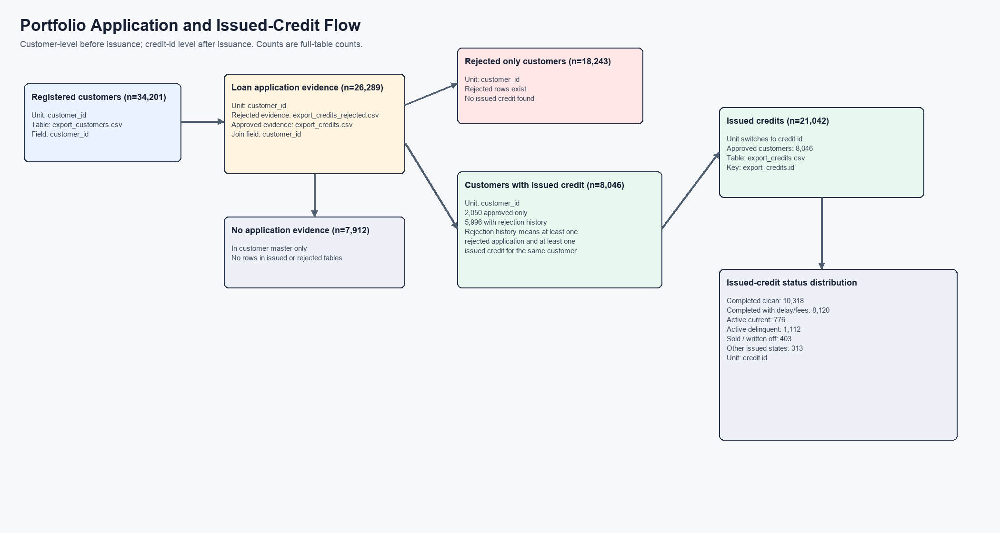

# Portfolio Overview

This is a descriptive full-table portfolio view. Customer-level counts use `customer_id` before issuance; issued-credit status counts use `export_credits.id` after issuance.

## Customer-Level Funnel

- Registered customers: `34,201`
- Customers with loan application evidence: `26,289` (76.9% of registered customers)
- Customers with no application evidence: `7,912` (23.1%)
- Customers with at least one rejected application: `24,239`
- Customers with at least one issued/approved credit: `8,046`
- Rejected only: `18,243`
- Approved only: `2,050`
- Issued customers with rejection history: `5,996`

## Application / Credit Rows

- Rejected application rows: `64,039`
- Issued credit rows: `21,042`
- Row-level issued share among issued + rejected rows: `24.7%`
- Total requested amount in rejected rows: `EUR 113,149,886.00`
- Total issued principal amount: `EUR 27,231,984.90`
- Total planned charge in issued credits: `EUR 23,132,792.39`

## Issued-Credit Status

| status | credits | share | issued amount |
|---|---:|---:|---:|
| `completed_clean` | 10,318 | 49.0% | EUR 12,662,201.78 |
| `completed_with_delay_or_fees` | 8,120 | 38.6% | EUR 8,672,219.54 |
| `active_delinquent_current_delay` | 1,112 | 5.3% | EUR 2,167,632.83 |
| `active_current_not_due_or_no_delay` | 776 | 3.7% | EUR 1,902,143.48 |
| `sold_or_written_off` | 403 | 1.9% | EUR 386,512.54 |
| `other_unpaid_no_debt` | 309 | 1.5% | EUR 1,437,108.00 |
| `unpaid_past_maturity_no_current_delay` | 4 | 0.0% | EUR 4,166.73 |

## Delay And Debt Snapshot

- Paid credits: `18,438`
- Sum of `debt`: `EUR 4,305,977.76`
- Sum of `r_debt`: `EUR 4,750,497.47`
- Sum of `late_fee`: `EUR 39,566.39`
- `max_delay` buckets: `{'0': 10924, '90+': 2265, '1-30': 7194, '31-60': 439, '61-90': 220}`
- `current_delay` buckets: `{'0': 11712, '90+': 1900, '1-30': 6819, '31-60': 410, '61-90': 201}`

## Schedule Coverage

- Schedule rows: `1,048,575`
- Unique credit IDs in schedule table: `61,898`
- Issued credits with schedule rows: `12,859`
- Issued credits without schedule rows: `8,183`
- Schedule credit IDs not present in current `export_credits.csv`: `49,039`
- Planned schedule principal total: `EUR 40,617,789.19`
- Planned schedule interest total: `EUR 18,659,150.41`
- Planned schedule administrative fee total: `EUR 13,830,640.79`

## Notes

- Customer counts can overlap: a customer may have rejected applications and later issued credits.
- The mutually exclusive customer groups are `rejected_only`, `approved_only`, `issued customers with rejection history`, and `no_application`.
- The 8,046 customers with issued credit consist of 2,050 approved-only customers plus 5,996 issued customers with rejection history.
- Issued-credit status is counted by loan/credit ID, not by customer.
- `credits_schedules_all.csv` is planned installment schedule data, not actual payment history.